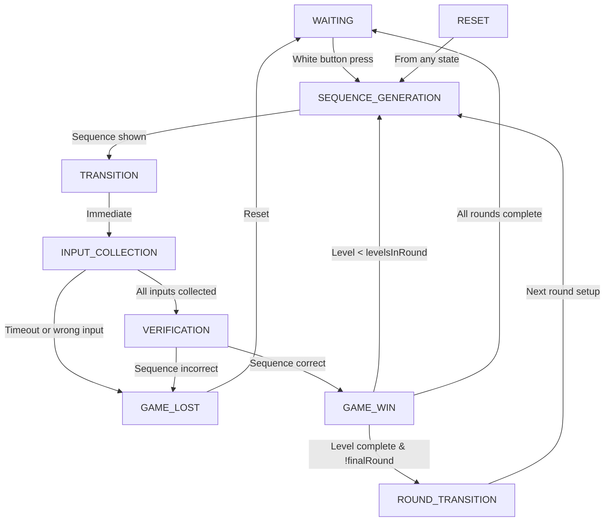

# Simona Game Flow

This document describes the normal flow of stages in the `runGameTask` function of the Simona game implementation.

## Stage Flow Overview

## Stage Details

### 1. WAITING Stage
- Initial state of the game
- Displays "Press White Button for Start Game"
- Waits for white button press to start
- Resets input timer

### 2. SEQUENCE_GENERATION Stage
- Generates new color sequence for current level
- Uses cheat mode if enabled (RED->GREEN->YELLOW->BLUE)
- Otherwise generates random sequence with max 2 same colors in a row
- Displays sequence to player through LEDs and sounds
- Updates SimonaMessage with current state
- Moves to TRANSITION stage

### 3. TRANSITION Stage
- Brief transition state
- Updates SimonaMessage
- Immediately moves to INPUT_COLLECTION

### 4. INPUT_COLLECTION Stage
- Player inputs their sequence
- Times out after SIMONA_INPUT_TIMEOUT_SECONDS
- On timeout → GAME_LOST
- On wrong input → GAME_LOST
- On correct complete sequence → VERIFICATION
- Updates SimonaMessage with lastPressedButton

### 5. VERIFICATION Stage
- Verifies player's input matches generated sequence
- If incorrect → GAME_LOST
- If correct → GAME_WIN
- Updates SimonaMessage

### 6. GAME_WIN Stage
Three possible outcomes:
1. If level < levelsInRound:
   - Increment level
   - Return to SEQUENCE_GENERATION
2. If level complete but not final round:
   - Move to ROUND_TRANSITION
3. If final round complete:
   - Play victory animation
   - Reset game state
   - Return to WAITING

### 7. GAME_LOST Stage
- Displays loss message
- Plays lost animation/sound
- Resets level to 1
- Resets lost flag
- Returns to WAITING

### 8. ROUND_TRANSITION Stage
- Plays transition effects
- Increments round number
- Increases levels per round
- Resets level to 1
- Returns to SEQUENCE_GENERATION

### 9. RESET Stage (Special)
- Can be triggered from any state
- Resets game state (level, round, etc.)
- Plays game intro
- Moves to SEQUENCE_GENERATION

## Game Variables

- **level**: Current level within a round
- **m_currentRound**: Current round number
- **m_levelsInRound**: Number of levels in current round
- **game_play**: Tracks progress through current sequence
- **lost**: Indicates if player has lost
- **inputStart**: Timer for input collection
- **led_simonSaid[]**: Stores generated sequence
- **bt_simonSaid[]**: Stores player's input sequence

## Important Constants

- MAX_ROUNDS: Maximum number of rounds in the game
- LEVELS_PER_ROUND_DEFAULT: Starting number of levels per round
- SIMONA_INPUT_TIMEOUT_SECONDS: Time allowed for player input
- MAX_LEVEL: Maximum supported level (array size)
